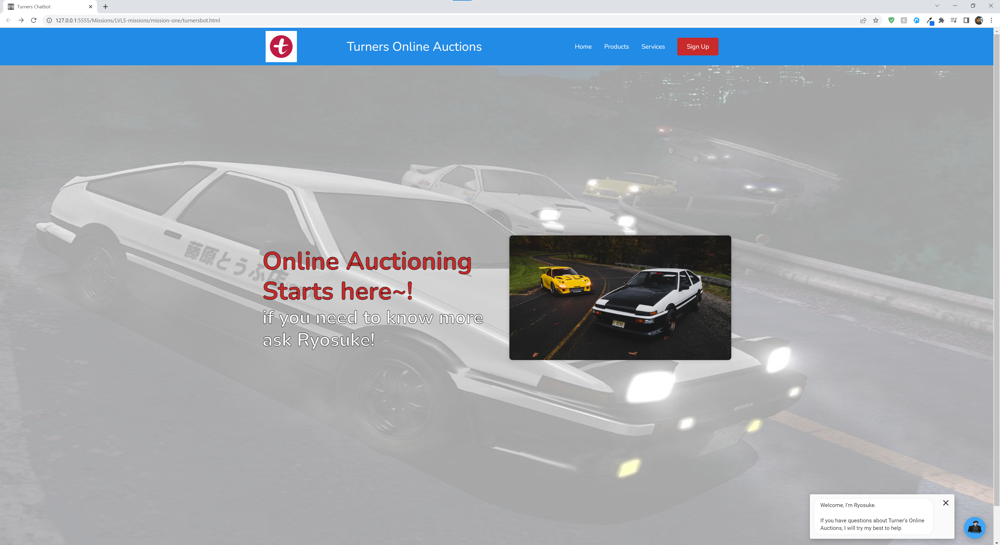
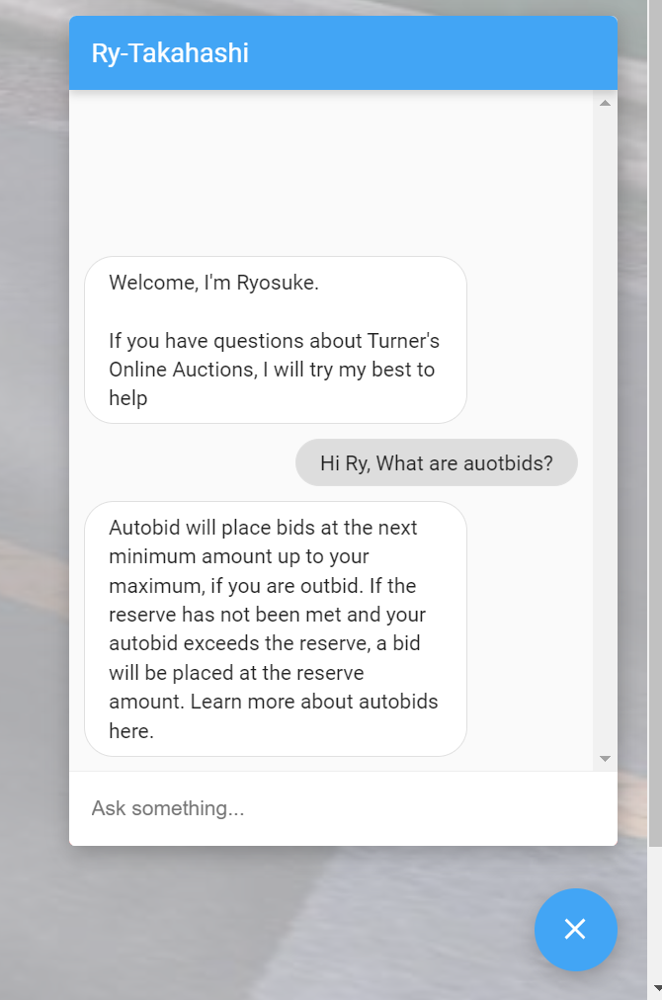

<a name="readme-top"></a>

<div align="center">
  <a href="https://github.com/JojorioCh/L5-Mission1">
    
    
    
  </a>
<h3 align="center">Dialogflow ChatBot Attempt</h3>
<p>Misson 1 task 4&5 to build and implement a chat bot</p>
</div>
<details>
<summary>T.O.C</summary>
<ol>
   <li>
      <a href="#about-the-project">About The Project</a>
      <ul>
        <li><a href="#built-with">Built With</a></li>
      </ul>
    </li>
    <li>
      <a href="#getting-started">Getting Started</a>
    </li>
    <li><a href="#contact">Contact</a></li>
    <li><a href="#acknowledgments">Acknowledgments</a></li>
  </ol>
</details>

## About the Project

&nbsp;&nbsp;&nbsp;

This Website and Chatbot were created as part of a class Mission Project with a focus of being able to create a chatbot using the assistance of Dialogflow.

I created this by referencing the FAQ section of the company that we requested to use and then from there pulling through the required questions we were asked to focus on and created the intents.

Given more time and training there is perhaps more that the bot can learn but for now this is just a simple step.

<p align="right">(<a href="#readme-top">back to top</a>)</p>

### Built With

- [SCSS]
- [Dialogflow](https://dialogflow.cloud.google.com/)

<br />

## Getting Started

1. Clone the repo
   ```sh
   git clone https://github.com/JojorioCh/L5-Mission1.git
   ```
2. login to Dialogflow

3. Create an agent

4. create knowledge document and use the url: https://www.turners.co.nz/FAQs-Cars/ as the source

5. Use the questions specifically for online auctions and create intents

6. modify and tests intents until you feel the bot is ready.

7. Once it is ready go to integrations and select Dialogflow Messenger and enable once the popup shows.

8. copy the code provided and paste it in the html files "HEAD" section.

9. Make changes to Scss files, or to the page itself to reflect whatever you like.

10. Have fun ヾ(⌐■_■)ノ ♪

<p align="right">(<a href="#readme-top">back to top</a>)</p>

<br/>

## Contact

Joseph Chang - [Joseph Chang](https://www.linkedin.com/in/joseph-chang-b25977144/) - joesfound@gmail.com

Project Link: [https://github.com/JojorioCh/L5-Mission0.git](https://github.com/JojorioCh/L5-Mission0.git)

<br />

## Acknowledgments

- This was just a simple HTML design but I would really like to shout out the following:

- [Chatimize](https://www.youtube.com/@chatimize) A YouTube content creator who had videos giving tips and tricks for Dialogflow

- [Ram Manthry](https://www.linkedin.com/in/ram-manthry-2a427715/), who patiently went through the SCSS and sassy-styling so that I could apply it to my coding here.

<p align="right">(<a href="#readme-top">back to top</a>)</p>

<!-- MARKDOWN LINKS & IMAGES -->
<!-- https://www.markdownguide.org/basic-syntax/#reference-style-links -->
